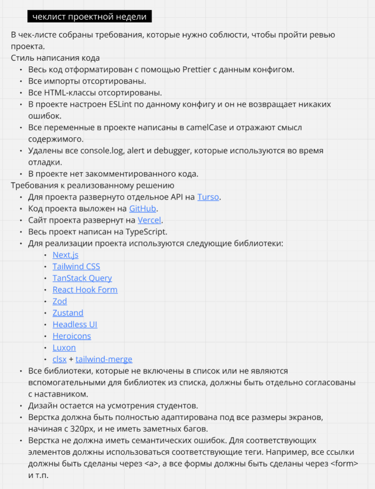

### Начало работы

После клонирования репозитория откройте интерфейс командной строки в этой папке и выполните команду:

```
npm install
```

### Общие требования

<p align="center"></p>

### Доска Миро целиком

[Доска Миро](https://miro.com/app/board/uXjVKPFlI1Y=/)

### Почитать сокращения tailwind

[Справочник тут](https://tailwindcss.com/docs/installation/using-vite)

Слевой стороны выбираете что нужно и копируете сокращение tailwind.

### Иконки, которые понадобятся в проекте

Смотреть иконки и их названия [тут](https://heroicons.com/)

Пример использования иконки из этой библиотеки и стили tailwind в index.tsx 

### Посмотреть пример от Яндекс.Практикум тудушка на Next.js

[Тудушка](https://disk.yandex.ru/d/q7ySzypHfWweJQ/%D0%92%D1%81%D1%82%D1%80%D0%B5%D1%87%D0%B8%20%D0%BF%D0%BE%20%D0%BF%D1%80%D0%BE%D0%B5%D0%BA%D1%82%D0%B0%D0%BC%20%D1%81%20%D0%AF%D0%9F/%D0%92%D1%81%D1%82%D1%80%D0%B5%D1%87%D0%B0%2017.01.mp4)

### Рекомендуемое дополнение к vscode

[tailwindcss](https://marketplace.visualstudio.com/items?itemName=bradlc.vscode-tailwindcss)